# TOPR Rescue

System zarządzania akcjami i zasobami ratowniczymi dla TOPR. Koordynatorzy planują akcje
i przypisują do nich ratowników i sprzęt; ratownicy przeglądają przydzielone zadania.

---

## Spis treści

1. [Stos technologiczny](#stos-technologiczny)
2. [Architektura MVC](#architektura-mvc)
3. [Zasady SOLID](#zasady-solid)
4. [Baza danych i diagram ERD](#baza-danych-i-diagram-erd)
5. [Trzecia Postać Normalna (3NF)](#trzecia-postać-normalna-3nf)
6. [Role i uprawnienia](#role-i-uprawnienia)
7. [Bezpieczeństwo](#bezpieczeństwo)
8. [Uruchomienie (Docker)](#uruchomienie-docker)
9. [Endpointy](#endpointy)
10. [Scenariusz testowy](#scenariusz-testowy)
11. [Testy automatyczne](#testy-automatyczne)
12. [Zrzuty ekranu](#zrzuty-ekranu)
13. [Checklist wymagań](#checklist-wymagań)

---

## Stos technologiczny

| Warstwa        | Technologia                                                        |
|----------------|--------------------------------------------------------------------|
| Backend        | PHP 8.3 (czysty OOP, bez frameworków), wzorzec MVC                |
| Baza danych    | PostgreSQL 16 (relacje, widoki, funkcje, wyzwalacze, transakcje)   |
| Frontend       | HTML5, CSS3 (własny system designu, zmienne CSS, dark theme, RWD)  |
| JavaScript     | Vanilla JS (Fetch API / AJAX, walidacja formularzy po stronie klienta) |
| Konteneryzacja | Docker + docker-compose (nginx, php-fpm, PostgreSQL, pgAdmin)      |
| Auth / sesje   | Natywne sesje PHP, CSRF, bcrypt                                    |

---

## Architektura MVC

Własny front controller (`index.php`), router (`Routing.php`) i podział na warstwy bez frameworka:

```
index.php          → bootstrap, autoloader, globalny exception handler
Routing.php        → mapowanie ścieżek na kontrolery i metody
src/
 ├─ Controllers/   → SecurityController, DashboardController, MissionController,
 │                   EquipmentController, UserController (dziedziczy AppController)
 ├─ Repository/    → warstwa PDO (prepared statements, transakcje)
 ├─ Entity/        → obiekty domenowe: User, Mission, Equipment
 └─ Services/      → DatabaseService (singleton PDO), SessionService (sesje, CSRF, role)
public/
 ├─ views/         → layout.php + podstrony per moduł
 ├─ css/app.css    → zmienne CSS, dark theme, RWD
 └─ js/app.js      → sidebar, filtrowanie, walidacja, AJAX
```

Przepływ: `nginx → index.php → Routing → Controller → Repository (PDO) → render(View)`.

---

## Zasady SOLID

| Zasada | Zastosowanie w projekcie |
|--------|--------------------------|
| **S** — Single Responsibility | Każda klasa ma jeden powód do zmiany: kontroler steruje, repozytorium odpytuje bazę, encja przechowuje dane i logikę domenową, `SessionService` zarządza sesją i CSRF, `DatabaseService` wyłącznie tworzy połączenie PDO. |
| **O** — Open/Closed | `AppController` dostarcza `render()`, `redirect()`, `json()` itd. — nowy moduł to nowy kontroler rozszerzający bazę, bez dotykania istniejącego kodu. Nowe trasy dopisuje się do `Routing.php`. |
| **L** — Liskov Substitution | Wszystkie kontrolery rozszerzają `AppController` i respektują jego kontrakt. Encje są samodzielnymi obiektami bez efektów ubocznych — widoki mogą na nich polegać bez znajomości konkretnego typu. |
| **I** — Interface Segregation | Brak formalnych interfejsów PHP — świadoma decyzja: trzy repozytoria z rozłącznym API nie wymagają polimorficznego użycia; każde udostępnia dokładnie to, czego potrzebuje obsługujący je kontroler. |
| **D** — Dependency Inversion | Repozytoria pobierają połączenie przez `DatabaseService::getInstance()`, `UserRepository` jest singletonem. Kompromis bez kontenera DI: kontrolery nie znają szczegółów PDO ani konfiguracji połączenia. |

---

## Baza danych i diagram ERD

Baza `topr_rescue` (PostgreSQL) zawiera **8 tabel** z relacjami 1:1, 1:N i M:N, **2 widoki**,
**1 funkcję**, **2 wyzwalacze** oraz transakcje w warstwie repozytoriów.
Pełny skrypt: [`docker/db/init/init.sql`](docker/db/init/init.sql) — ładowany automatycznie
przy starcie kontenera.

### Diagram ERD

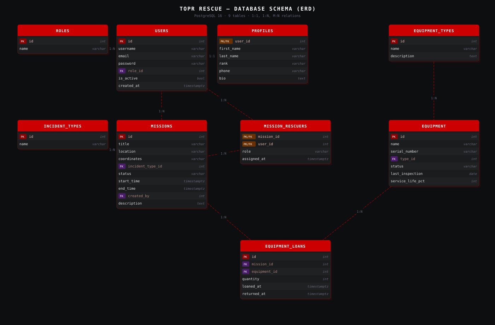

```mermaid
erDiagram
    ROLES ||--o{ USERS : "określa rolę"
    USERS ||--|| PROFILES : "ma profil (1:1)"
    USERS ||--o{ MISSIONS : "tworzy (created_by)"
    USERS ||--o{ MISSION_RESCUERS : "bierze udział"
    MISSIONS ||--o{ MISSION_RESCUERS : "ma przypisanych"
    MISSIONS ||--o{ EQUIPMENT_LOANS : "wykorzystuje"
    EQUIPMENT ||--o{ EQUIPMENT_LOANS : "jest wypożyczany"
    INCIDENT_TYPES ||--o{ MISSIONS : "kategoryzuje"
    EQUIPMENT_TYPES ||--o{ EQUIPMENT : "kategoryzuje"

    ROLES { int id PK; string name "coordinator / rescuer" }
    USERS { int id PK; string username; string email; string password "hash bcrypt"; int role_id FK; timestamptz created_at; bool is_active }
    PROFILES { int user_id PK "1:1 z users (FK)"; string first_name; string last_name; string rank; string phone; text bio }
    INCIDENT_TYPES { int id PK; string name }
    MISSIONS { int id PK; string title; string location; string coordinates; int incident_type_id FK; string status "open/active/completed/cancelled"; timestamptz start_time; timestamptz end_time; int created_by FK }
    EQUIPMENT_TYPES { int id PK; string name }
    EQUIPMENT { int id PK; string name; string serial_number; int type_id FK; string status "ready/in_use/maintenance/retired/lost"; date last_inspection; int service_life_pct }
    MISSION_RESCUERS { int mission_id PK; int user_id PK; string role "leader/medic/rescuer"; timestamptz assigned_at }
    EQUIPMENT_LOANS { int id PK; int mission_id FK; int equipment_id FK; int quantity; timestamptz loaned_at; timestamptz returned_at }
```

### Relacje

- **1:1** — `users` ↔ `profiles` (PK `profiles.user_id` = FK do `users.id`)
- **1:N** — `roles → users`, `incident_types → missions`, `equipment_types → equipment`, `users → missions` (`created_by`)
- **M:N** — `missions ↔ users` przez `mission_rescuers` (atrybuty: `role`, `assigned_at`); `missions ↔ equipment` przez `equipment_loans` (atrybuty: `quantity`, `loaned_at`, `returned_at`)

### Akcje referencyjne (wybrane)

- `users.role_id … ON DELETE RESTRICT` — nie można usunąć roli z przypisanymi użytkownikami
- `profiles.user_id … ON DELETE CASCADE` — usunięcie użytkownika usuwa profil
- `missions.incident_type_id … ON DELETE SET NULL` — usunięcie typu zdarzenia nie kasuje akcji
- `mission_rescuers`, `equipment_loans … ON DELETE CASCADE` — usunięcie akcji usuwa powiązania

### Widoki, funkcja, wyzwalacze

- **`active_missions_view`** — aktywne akcje z liczbą ratowników (`COUNT`, `STRING_AGG`) i czasem trwania
- **`equipment_usage_report`** — ile razy i w jakich akcjach użyto danego sprzętu
- **`calculate_mission_duration(id)`** — czas trwania akcji w minutach (do teraz lub do `end_time`)
- **`trg_activate_mission_on_rescuer`** — `AFTER INSERT ON mission_rescuers` → zmienia status `open → active`
- **`trg_equipment_loan_status`** — `AFTER INSERT OR DELETE ON equipment_loans` → ustawia `in_use` / `ready`

---

## Trzecia Postać Normalna (3NF)

Schemat spełnia **3NF** — brak redundancji i odporność na anomalie wstawiania/aktualizacji/usuwania.

- **1NF** ✅ — wartości atomowe, każda tabela ma PK, brak grup powtarzających się
- **2NF** ✅ — atrybuty tabel ze złożonym PK (`mission_rescuers`) zależą od **całego** klucza (`role`, `assigned_at` opisują konkretne przypisanie, nie samą akcję ani samego ratownika)
- **3NF** ✅ — brak zależności tranzytywnych: nazwa roli → tabela `roles`; typ zdarzenia → `incident_types`; kategoria sprzętu → `equipment_types`; atrybuty profilu → tabela `profiles` (relacja 1:1 z `users`). Zmiana np. nazwy roli wymaga aktualizacji **jednego** wiersza, nie setek.

---

## Role i uprawnienia

| Rola          | Uprawnienia                                                                    |
|---------------|--------------------------------------------------------------------------------|
| `coordinator` | Pełny dostęp: tworzenie/edycja/usuwanie akcji i sprzętu, przypisywanie ratowników, zarządzanie kontami |
| `rescuer`     | Tylko odczyt (przegląd akcji, sprzętu), zarządzanie własnym profilem           |

Kontrola dostępu jest **dwuwarstwowa**: backend (`requireLogin()` / `requireCoordinator()` w każdym kontrolerze — próba wejścia bez roli → **403**) + frontend (warunkowe ukrywanie przycisków przez `isCoordinator()`).

---

## Bezpieczeństwo

- ✅ SQL injection — wyłącznie *prepared statements* z nazwanymi parametrami (PDO)
- ✅ Generyczne komunikaty logowania — bez enumeracji kont (B1)
- ✅ Walidacja formatu email po stronie serwera (`filter_var`)
- ✅ Token CSRF w formularzach, weryfikowany `hash_equals()` — próba bez tokenu → **403**
- ✅ Hasła jako hash `bcrypt` (`password_hash` / `password_verify`), nigdy w logach
- ✅ Regeneracja ID sesji po logowaniu (ochrona przed session fixation)
- ✅ Flagi cookie: `HttpOnly`, `SameSite=Lax`, dynamicznie `Secure` (na HTTPS)
- ✅ Limit prób logowania — po 5 nieudanych → blokada 5 min → **429** (A4)
- ✅ Escapowanie danych w widokach (`htmlspecialchars`) — ochrona przed XSS
- ✅ `display_errors=Off` w produkcji, własny `set_exception_handler` (E4)
- ✅ Sensowne kody HTTP (400/403/404/429/500)
- ✅ Zapytania bez `SELECT *` — tylko niezbędne kolumny (C5)
- ✅ Pełne zniszczenie sesji przy wylogowaniu (`session_unset`, `session_destroy`, czyszczenie cookie)
- ✅ `UserRepository` jako singleton (D1)

---

## Uruchomienie (Docker)

**Wymagania:** Docker + Docker Compose.

```bash
# Pierwsze uruchomienie
docker-compose up --build

# Reset bazy "od zera" (po zmianie init.sql)
docker-compose down -v && docker-compose up --build
```

- Aplikacja: **http://localhost:8080**
- pgAdmin: **http://localhost:5050** (login: `admin@example.com`, hasło: `admin`)

### Konta testowe (hasło: `password`)

| Rola        | E-mail                  |
|-------------|-------------------------|
| Koordynator | koordynator@topr.pl     |
| Ratownik    | ratownik1@topr.pl       |
| Ratownik    | ratownik2@topr.pl       |
| Ratownik    | ratownik3@topr.pl       |

---

## Endpointy

| Metoda     | Ścieżka                                          | Akcja                                  | Dostęp      |
|------------|--------------------------------------------------|----------------------------------------|-------------|
| GET/POST   | `/login`, `/register`                            | `SecurityController`                   | publiczny   |
| GET        | `/logout`                                        | `SecurityController::logout`           | zalogowany  |
| GET        | `/dashboard`                                     | `DashboardController::index`           | zalogowany  |
| GET        | `/missions`, `/missions/{id}`                    | `MissionController::index/show`        | zalogowany  |
| GET/POST   | `/missions/new`, `/{id}/edit`, `/{id}/delete`    | `MissionController`                    | koordynator |
| POST       | `/missions/{id}/rescuers[/remove]`               | `MissionController::add/removeRescuer` | koordynator |
| GET        | `/equipment`, `/equipment/{id}`                  | `EquipmentController::index/show`      | zalogowany  |
| GET/POST   | `/equipment/new`, `/{id}/edit`, `/{id}/delete`   | `EquipmentController`                  | koordynator |
| GET/POST   | `/users`, `/users/{id}/edit`                     | `UserController`                       | koordynator |
| GET/POST   | `/profile`                                       | `UserController::profile`              | zalogowany  |
| GET        | `/api/missions`, `/api/equipment`, `/api/stats`  | JSON API (Fetch/AJAX)                  | zalogowany  |
| POST       | `/api/missions/{id}/equipment`                   | `EquipmentController::apiLoanEquipment`| koordynator |

---

## Scenariusz testowy

1. **Logowanie** — `/login` → `koordynator@topr.pl` / `password` → przekierowanie na `/dashboard`.
2. **Walidacja JS** — błędny format e-mail → pole podświetla się na czerwono przed wysłaniem.
3. **Limit prób (A4)** — 5 błędnych haseł → 6. próba zwraca **429** z komunikatem o blokadzie.
4. **Role** — zaloguj jako `ratownik1@topr.pl` / `password`: brak przycisków edycji w UI; wejście na `/missions/new` lub `/users` → strona **403 Forbidden**.
5. **Wyzwalacz akcji** — utwórz akcję, przypisz ratownika → status zmienia się `open → active` automatycznie.
6. **Wyzwalacz sprzętu** — dodaj sprzęt do akcji przez formularz AJAX → status pozycji zmienia się na `in_use`.
7. **Widoki SQL** — w pgAdmin: `SELECT * FROM active_missions_view;` i `SELECT * FROM equipment_usage_report;`.
8. **Wylogowanie** — po wylogowaniu powrót przyciskiem "wstecz" → przekierowanie na `/login`.

---

## Testy automatyczne

### Jednostkowe (PHPUnit) — 34 testy, brak połączenia z bazą

```bash
docker-compose exec php sh -c "composer install && composer run test:unit"
```

Pokrycie: `SessionServiceTest` (CSRF, flash, role, limit logowań A4), `UserEntityTest` (mapowanie, bcrypt), `MissionEntityTest` (statusy, badge CSS).

### Integracyjne (curl) — 22 asercje HTTP, wymaga działającego `docker-compose up`

```bash
./tests/Integration/run.sh
```

Sprawdza: dostępność stron publicznych, ochronę tras, odrzucenie żądań bez CSRF (**403**), generyczne błędy logowania, blokadę po 5 próbach (**429**), poprawne logowanie i wylogowanie.

---

## Zrzuty ekranu

### Logowanie

| Desktop | Mobile |
|---------|--------|
| 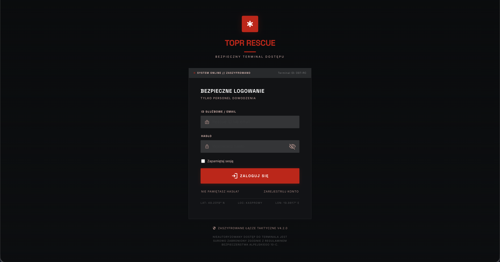 | 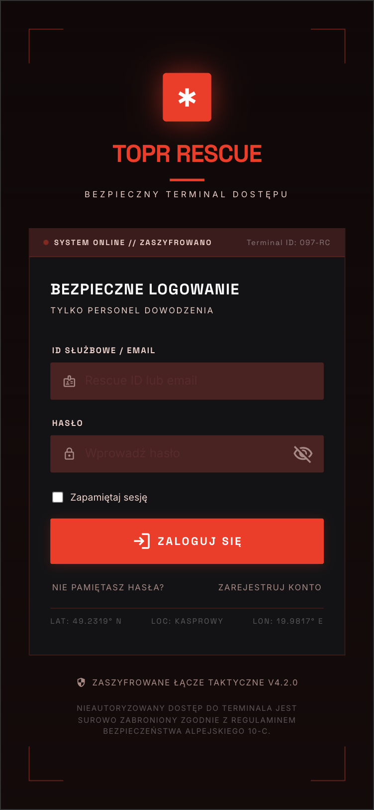 |

### Dashboard

| Desktop | Mobile |
|---------|--------|
| 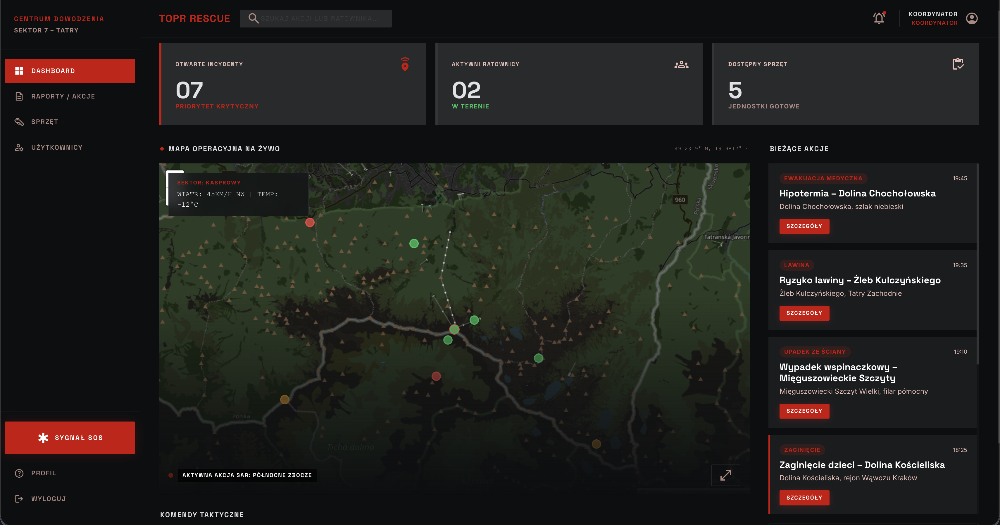 | 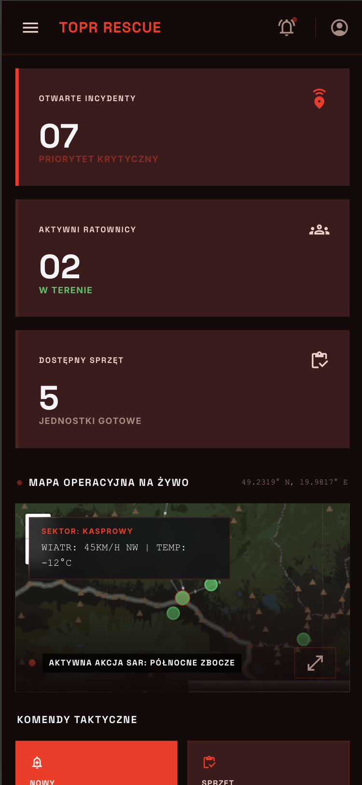 |

### Nawigacja mobilna (sidebar)

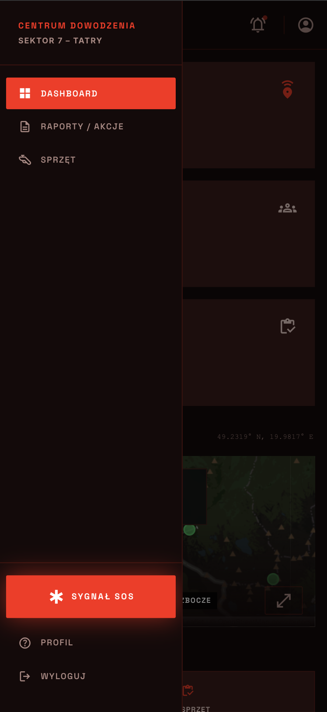

### Lista akcji ratunkowych

| Desktop | Mobile |
|---------|--------|
| 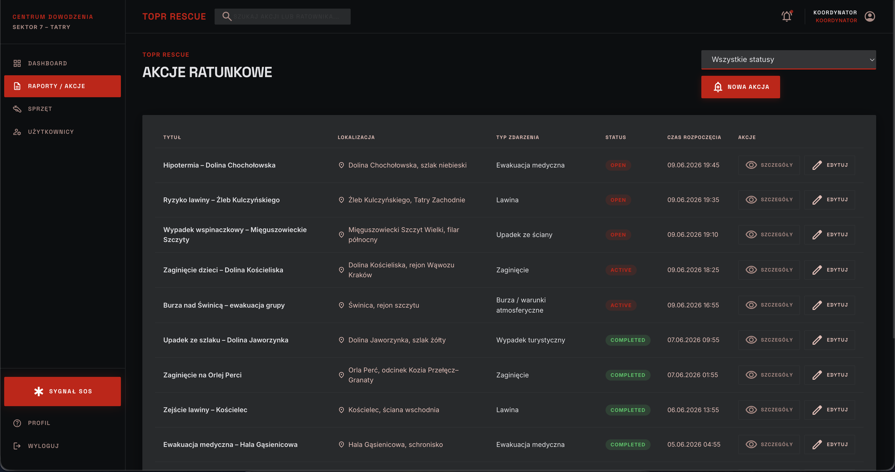 | 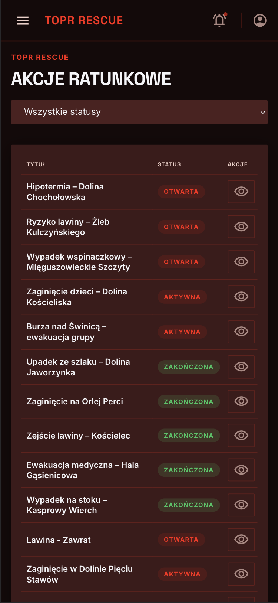 |

### Szczegóły akcji ratunkowej (z mapą GPS)

| Desktop | Mobile |
|---------|--------|
| 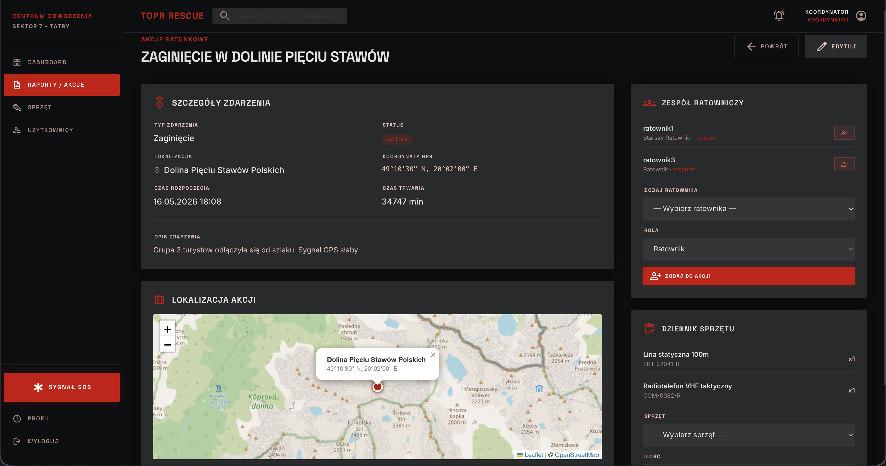 | 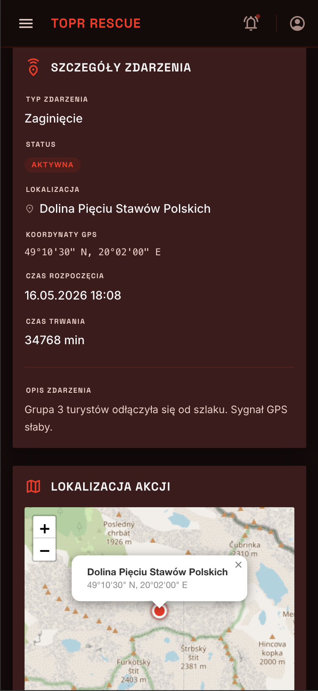 |

### Sprzęt ratunkowy

| Desktop | Mobile |
|---------|--------|
| 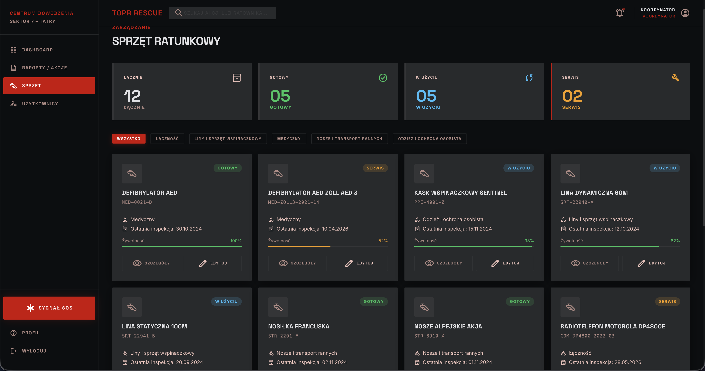 | 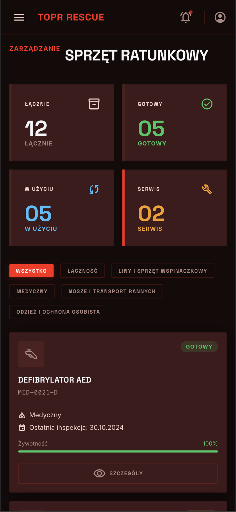 |

### Zarządzanie użytkownikami i profil

| Lista użytkowników (koordynator) | Profil użytkownika (mobile) |
|----------------------------------|------------------------------|
| 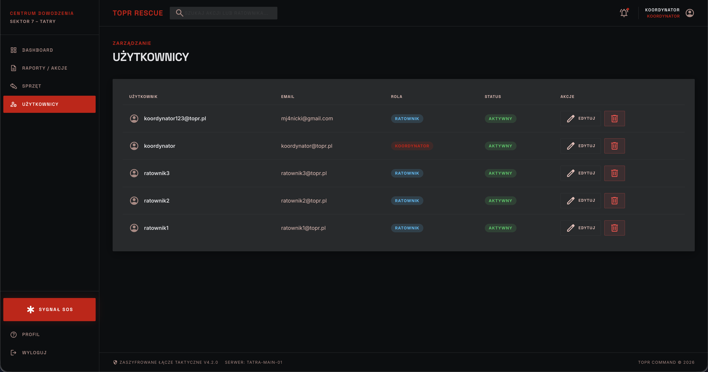 | 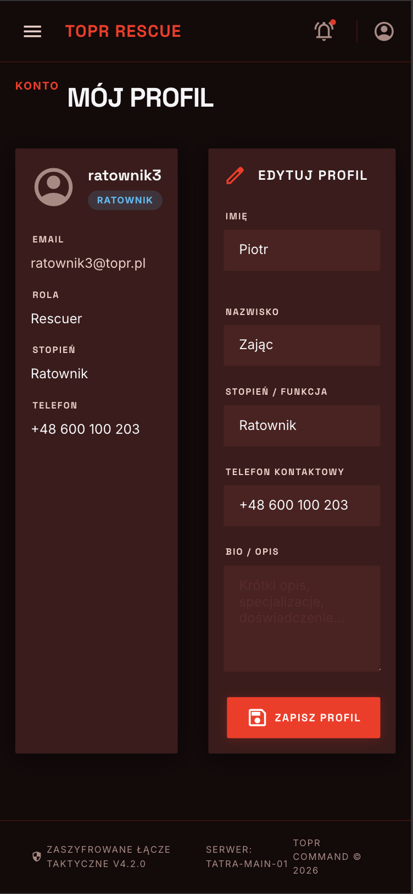 |

---

## Checklist wymagań

| Kryterium                                               | Status |
|---------------------------------------------------------|:------:|
| Dokumentacja w README (opis, ERD, screeny)              | ✅ |
| Docker                                                  | ✅ |
| Architektura MVC                                        | ✅ |
| Kod obiektowy (backend)                                 | ✅ |
| Zasady SOLID (opis + analiza)                           | ✅ |
| Diagram ERD                                             | ✅ |
| Trzecia Postać Normalna 3NF (opis + analiza)            | ✅ |
| Git (systematyczne commity)                             | ✅ |
| Realizacja tematu                                       | ✅ |
| HTML                                                    | ✅ |
| PostgreSQL                                              | ✅ |
| Złożoność bazy (relacje 1:1, 1:N, M:N)                  | ✅ |
| Eksport bazy do .sql                                    | ✅ |
| PHP                                                     | ✅ |
| JavaScript                                              | ✅ |
| Fetch API (AJAX)                                        | ✅ |
| Design                                                  | ✅ |
| Responsywność (desktop + mobile)                        | ✅ |
| Logowanie                                               | ✅ |
| Sesja użytkownika                                       | ✅ |
| Uprawnienia użytkowników                                | ✅ |
| Role (co najmniej dwie)                                 | ✅ |
| Wylogowywanie                                           | ✅ |
| Widoki, wyzwalacze, funkcje, transakcje                 | ✅ |
| Akcje na referencjach                                   | ✅ |
| Bezpieczeństwo                                          | ✅ |
| Brak replikacji kodu                                    | ✅ |
| Czystość i przejrzystość kodu                           | ✅ |
